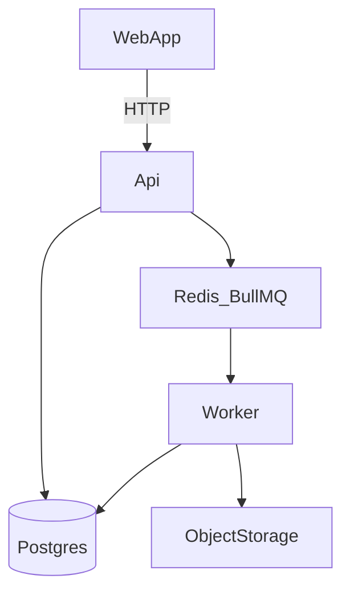

# Architecture (initial)

This doc is a living note as we build LedgerLens in stages.

## Services and responsibilities

- **Web (`apps/web`)**\n  UI for authentication, document upload, transaction exploration (pagination), dashboards (charts), and later an AI Q&A panel.\n\n- **API (`apps/api`)**\n  Owns authentication/authorization, REST endpoints, document lifecycle, and job orchestration. It is kept responsive by pushing long-running work to the worker.\n\n- **Worker (`apps/worker`)**\n  Owns background processing (parsing, normalization, persistence, aggregation). It pulls work from a queue and updates document status.\n+
## Data stores

- **Postgres**\n  System of record for users, documents, transactions, and summary tables.\n\n- **Redis**\n  Job queues (BullMQ) and caching (later).\n\n- **Object storage (S3/MinIO)**\n  Stores uploaded documents. The DB stores *metadata* and a storage key.\n+
## Document ingestion (high-level)

1. User uploads a file via the Web app.\n2. API creates a `document` record and provides an upload mechanism (later: presigned URL).\n3. API enqueues an `INGEST_DOCUMENT` job.\n4. Worker downloads the file, parses/validates, normalizes rows, and persists transactions.\n5. Worker computes deterministic summaries/anomalies.\n6. Worker updates the `document` status to `COMPLETED` or `FAILED` with error details.\n+
## Why async matters here

Parsing PDFs/CSVs and aggregating large datasets can be slow. Keeping this off the request path improves:\n- user experience (API stays snappy)\n- reliability (retries/backoff)\n- scalability (add more workers)\n+
## Ingestion flow diagram

## Initial data model sketch (conceptual)

- `users`\n- `documents` (owned by a user; points to object storage; has status)\n- `transactions` (normalized; linked to user + document)\n- `monthly_summaries` and `category_monthly_summaries` (aggregated tables)\n- `anomalies` (deterministic flags over transactions)\n+
