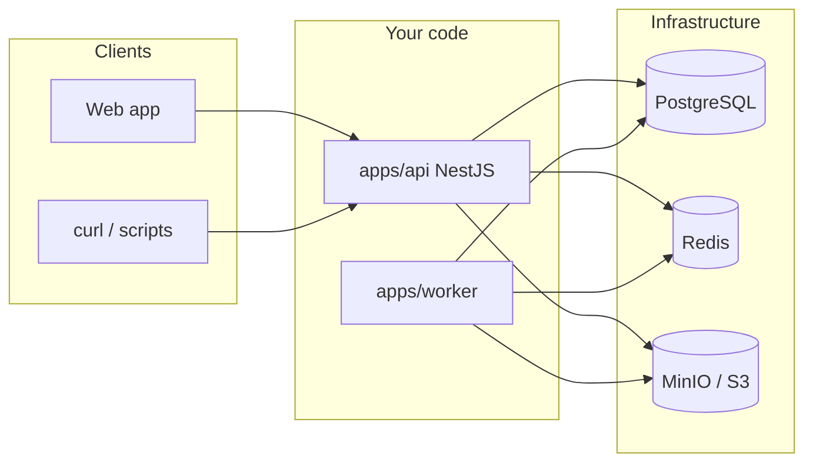

# Repository layout (beginner map)

This doc answers: **what lives where**, and **what is *not* the database**.

---

## Is `migration.sql` the database?

**No.** Here’s the distinction:

| Thing | What it is |
| ----- | ------------ |
| **PostgreSQL** | The actual **database server** — where rows live (`Document`, `Transaction`, …). You run it locally (Docker, Postgres.app, etc.) or in the cloud (RDS). |
| **`schema.prisma`** | The **blueprint** Prisma uses: “these are our models and fields.” It does not *contain* your data. |
| **`migrations/*/migration.sql`** | **One-time scripts** that tell Postgres how to **change** its structure (create tables, add columns). They are versioned in git so every environment can apply the same changes in order. |
| **Running migrations** | Command (e.g. `prisma migrate deploy`) that **executes** those SQL files **against** your Postgres. After that, the DB **has** those tables/columns. |

So: **`migration.sql` is instructions for the database, not the database itself.** Your **data** lives in **Postgres** after you connect with the right `DATABASE_URL`.

---

## Top level: four areas

```
ledgerlens/
├── apps/
│   ├── api/      ← HTTP API (NestJS): routes, services, Prisma, queues
│   ├── worker/   ← Background jobs: CSV parse, future analytics jobs
│   └── web/      ← Frontend (React): UI (still minimal / scaffold)
├── docs/         ← Human-readable docs (architecture, progress, this file)
├── package.json  ← Monorepo root (pnpm workspaces)
└── README.md
```

- **`apps/`** = runnable applications (three separate processes in production).
- **`docs/`** = markdown only; not executed at runtime.

---

## `apps/api` (backend HTTP server)

Nest is organized by **feature modules** + **infrastructure folders**.

| Path | Role |
| ---- | ---- |
| **`src/main.ts`** | Boots NestJS and listens on a port (`PORT`). |
| **`src/app.module.ts`** | Root module: imports **feature** + **infra** modules below. |
| **`src/health/`** | **`HealthModule`** — `GET /` (hello / liveness). |
| **`src/documents/`** | **`DocumentsModule`** — documents + upload + transactions HTTP API. |
| **`src/analytics/`** | **`AnalyticsModule`** — `GET /documents/:id/analytics/monthly` and `.../by-category` (materialized rollups; filters + pagination). |
| **`src/prisma/`** | **`PrismaModule`** (`@Global`) + **`PrismaService`** — DB access. |
| **`src/queue/`** | **`QueueModule`** + **`QueueService`** + **`queue.constants.ts`** — BullMQ. |
| **`src/storage/`** | **`StorageModule`** + **`StorageService`** — MinIO/S3 presigned URLs, `HeadObject`. |
| **`prisma/schema.prisma`** | **Data models** (`Document`, `Transaction`, …). |
| **`prisma/migrations/`** | **`migration.sql` files** (schema history). |
| **`prisma.config.ts`** | Prisma CLI config (where schema lives, DB URL). |
| **`.env` / `.env.example`** | Secrets and config (not committed: `.env`). |

**Note:** You may see `src/generated/prisma/` locally — that can be from an old Prisma output path. The **normal** generated client lives under **`node_modules/@prisma/client`** after `pnpm exec prisma generate`. Ignore or delete local `generated/` if you’re not using a custom output.

**Stage 6** added **`src/analytics/`** (`AnalyticsModule`) for read-only dashboard queries backed by materialized summary tables; the worker refreshes those tables after each successful ingest.

---

## `apps/worker` (background process)

| Path | Role |
| ---- | ---- |
| **`src/index.ts`** | BullMQ worker: connect Redis, process `INGEST_DOCUMENT`, download S3, parse CSV, write DB, **rebuild per-document summary tables**. |
| **`src/aggregate-summaries.ts`** | Recomputes **`DocumentMonthlySummary`** / **`CategoryMonthlySummary`** for one document from transactions. |
| **`src/parse-csv.ts`** | CSV parsing rules (headers, amounts, dates). |
| **`.env` / `.env.example`** | Same idea as API: `DATABASE_URL`, `REDIS_URL`, `S3_*`. |

No HTTP server — it **pulls jobs** from Redis and talks to Postgres + S3.

---

## `apps/web` (frontend)

Currently mostly **scaffold** (`package.json`, `README.md`). When Stage 2+ frontend work lands, expect something like:

- `src/` — React components, pages, API client
- `public/` — static assets

---

## `docs/`

| File | Purpose |
| ---- | ------- |
| **`architecture.md`** | Big-picture design (services, stores, flows). |
| **`progress.md`** | Build diary: what we did, bugs, migrations. |
| **`repo-layout.md`** | This file — where things live. |
| **`sample-transactions.csv`** | Example CSV for testing ingestion. |

---

## How the pieces talk (mental model)



- **API**: user-facing HTTP, writes metadata, enqueues work.
- **Worker**: heavy lifting off the request thread.
- **Postgres**: source of truth for structured data.
- **Redis**: job queue (not the main data store).
- **S3/MinIO**: raw uploaded files.

---
